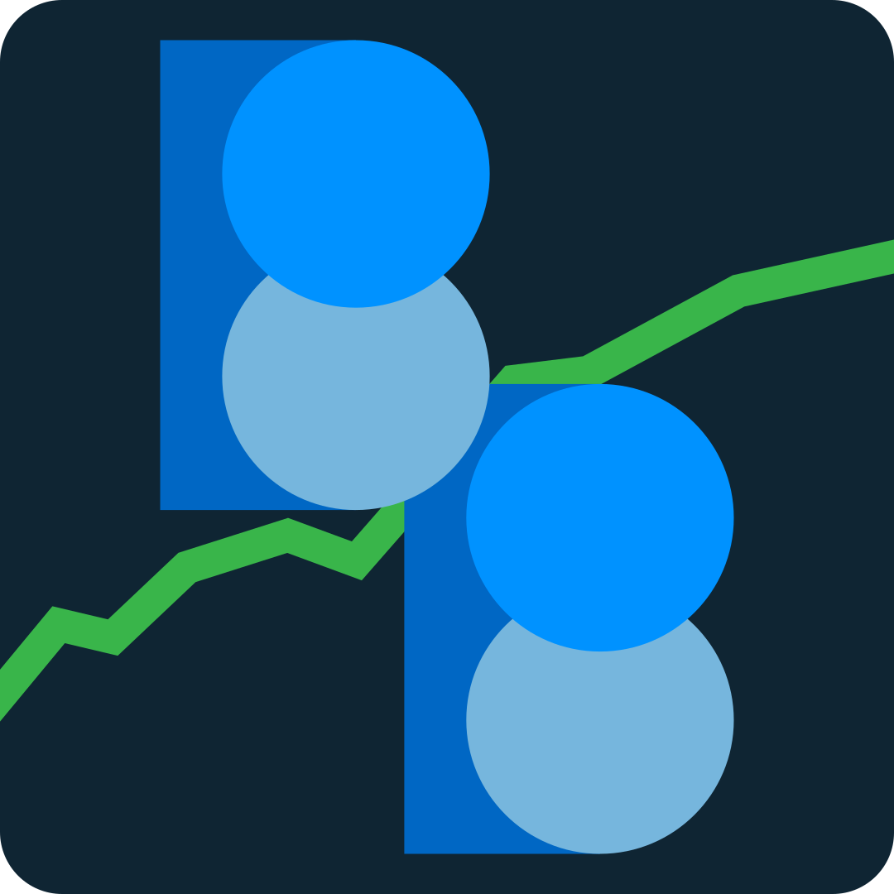
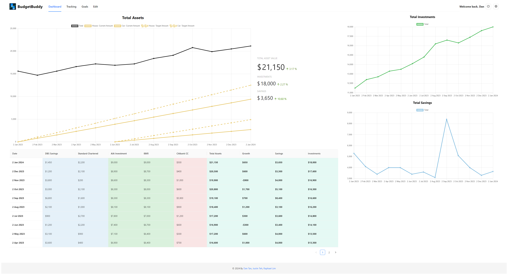

# BudgetBuddy 

Welcome to [BudgetBuddy](https://budgetbuddy.cyclic.app/)! 

If you're using multiple bank accounts, credit cards, or investment accounts, that's where BudgetBuddy comes in handy. Our app centralizes all your financial information in one secure location, making it easier to visualize their financial progress over time.
Our app also offers features for setting savings goals, and generating reports to gain insights into your financial health. 

## Project Requirements 🏗
- Be a full-stack MERN application.
- Connect to and perform data operations on a MongoDB database
- Have full-CRUD data operations across any combination of the app's models (excluding the User model). For example, creating/reading/updating posts and creating/deleting comments qualifies as full-CRUD data operations.
- Have suitable validations for the models, React (client) and Express (server)
- Authenticate users using JWT.
- Implement authorization by restricting access to the Creation, Updating & Deletion of data resources
- Be styled such that the app looks and feels similar to apps we use on a daily basis - in other words, it should have a consistent and polished user interface.
- Be deployed online. Presentations must use the deployed application.

## Technologies Used 🚀
- ReactJS
- Express
- MongoDB
- Ant Design
- Chart.js
- NodeJS
- JavaScript
- HTML
- CSS

## Planning Stage 📋
- Initial wireframes

 
- Entity Relation Diagram (ERD)

## Pitch deck & Trello 🛣
- [Prelim pitch](https://docs.google.com/presentation/d/1yAMAWRuXFSxkWzYuvspMYwdoa47ccMI2yM9Fj2CUxxs/edit#slide=id.g54dda1946d_6_344/)
- [Kanban board](https://trello.com/b/oLCJqn8o/budgetbuddy/)

## Icebox Features 🧊
This app is created given a 1 week timeline. There are still many opportunities to improve the product, such as:
- Users to be able to compare investment returns to S&P 500 or other common standards of return 
- Users to be able to filter tables and graphs
- Users to be able to update one's passwords 
